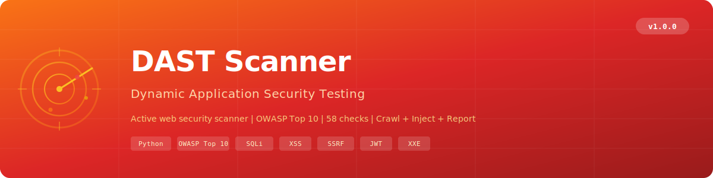

<p align="center">
  
</p>

# Dynamic Application Security Testing (DAST) Scanner

An open-source, single-file Python-based **Dynamic Application Security Testing** scanner that actively crawls and tests live web applications for **OWASP Top 10 2021** vulnerabilities, misconfigurations, and information disclosure issues.

**Only one external dependency** (`requests`) -- runs on Python 3.10+ on Windows, macOS, and Linux.

---

## Why DAST?

Static analysis finds code-level issues, but misses runtime vulnerabilities. This scanner fills the gap by:

- **Crawling** the target application via BFS with robots.txt/sitemap.xml pre-crawl, form extraction, and JS endpoint discovery
- **Injecting** real payloads (SQL injection, XSS, SSRF, LFI, XXE) and analysing responses for vulnerability evidence
- **Auditing** security headers, cookie flags, CORS policy, exposed files, API documentation, and JWT configuration
- **Detecting** WAFs (Cloudflare, AWS WAF, Imperva, Akamai, ModSecurity, F5, Sucuri, Barracuda) before testing
- **Supporting** authenticated scanning via bearer tokens, cookies, HTTP basic auth, or form-based login

---

## Features

- **58 security checks** across 11 categories mapped to OWASP Top 10 2021
- **BFS web crawler** with configurable depth, page limits, and scope enforcement
- **5 authentication modes** -- none, bearer, cookie, basic, form-based login
- **WAF detection** for 8 major WAF vendors
- **Technology fingerprinting** -- server, framework, CMS, language detection
- **Rate limiting** with token bucket algorithm (configurable requests/second)
- **Scope enforcement** -- only scans the target host, never leaves scope
- **3 output formats** -- coloured console, JSON, interactive HTML
- **Parallel execution** -- ThreadPoolExecutor with 4 workers for check modules
- **Proxy support** -- route traffic through Burp Suite, ZAP, or any HTTP proxy
- **Exit codes** -- returns `1` if CRITICAL or HIGH findings, `0` otherwise (CI/CD friendly)
- **Single file** -- entire scanner is one portable Python file

---

## Security Checks (58 Rules)

### Injection (7 Rules)

| Rule ID | Name | Severity |
|---------|------|----------|
| DAST-INJ-001 | SQL injection (error-based) via URL params | CRITICAL |
| DAST-INJ-002 | SQL injection (error-based) via forms | CRITICAL |
| DAST-INJ-003 | SQL injection (time-based blind) | CRITICAL |
| DAST-INJ-004 | SQL injection (boolean-based blind) | HIGH |
| DAST-INJ-005 | OS command injection via URL params | CRITICAL |
| DAST-INJ-006 | OS command injection via forms | CRITICAL |
| DAST-INJ-007 | NoSQL injection | HIGH |

### Cross-Site Scripting (5 Rules)

| Rule ID | Name | Severity |
|---------|------|----------|
| DAST-XSS-001 | Reflected XSS via URL parameters | HIGH |
| DAST-XSS-002 | Reflected XSS via forms | HIGH |
| DAST-XSS-003 | DOM-based XSS sinks detected | MEDIUM |
| DAST-XSS-004 | XSS via HTTP headers | HIGH |
| DAST-XSS-005 | Reflected content in error pages | MEDIUM |

### Authentication & Session (7 Rules)

| Rule ID | Name | Severity |
|---------|------|----------|
| DAST-AUTH-001 | Form without CSRF token | MEDIUM |
| DAST-AUTH-002 | Session cookie without HttpOnly | MEDIUM |
| DAST-AUTH-003 | Session cookie without Secure flag | MEDIUM |
| DAST-AUTH-004 | Session cookie without SameSite | LOW |
| DAST-AUTH-005 | Default/weak credentials accepted | CRITICAL |
| DAST-AUTH-006 | Username enumeration | MEDIUM |
| DAST-AUTH-007 | Session fixation | HIGH |

### Access Control (4 Rules)

| Rule ID | Name | Severity |
|---------|------|----------|
| DAST-AC-001 | Directory listing enabled | MEDIUM |
| DAST-AC-002 | Admin panel without authentication | HIGH |
| DAST-AC-003 | HTTP method tampering | MEDIUM |
| DAST-AC-004 | IDOR via predictable IDs | MEDIUM |

### Information Disclosure (11 Rules)

| Rule ID | Name | Severity |
|---------|------|----------|
| DAST-INFO-001 | .env file exposed | CRITICAL |
| DAST-INFO-002 | .git directory exposed | HIGH |
| DAST-INFO-003 | Server version in headers | LOW |
| DAST-INFO-004 | Stack trace / debug page | MEDIUM |
| DAST-INFO-005 | phpinfo() exposed | MEDIUM |
| DAST-INFO-006 | Database connection string | CRITICAL |
| DAST-INFO-007 | API keys in response | CRITICAL |
| DAST-INFO-008 | Internal IP address leaked | LOW |
| DAST-INFO-009 | Sensitive file exposed | MEDIUM |
| DAST-INFO-010 | WordPress wp-config.php | CRITICAL |
| DAST-INFO-011 | Directory listing | MEDIUM |

### Security Headers (9 Rules)

| Rule ID | Name | Severity |
|---------|------|----------|
| DAST-HDR-001 | Missing Content-Security-Policy | MEDIUM |
| DAST-HDR-002 | Missing X-Content-Type-Options | LOW |
| DAST-HDR-003 | Missing X-Frame-Options | MEDIUM |
| DAST-HDR-004 | Missing Strict-Transport-Security | MEDIUM |
| DAST-HDR-005 | Missing Referrer-Policy | LOW |
| DAST-HDR-006 | Missing Permissions-Policy | LOW |
| DAST-HDR-007 | X-Powered-By header exposes tech | LOW |
| DAST-HDR-008 | Insecure CORS (wildcard origin) | HIGH |
| DAST-HDR-009 | CORS origin reflection | HIGH |

### SSRF (3 Rules)

| Rule ID | Name | Severity |
|---------|------|----------|
| DAST-SSRF-001 | SSRF via URL parameter | CRITICAL |
| DAST-SSRF-002 | SSRF via form input | CRITICAL |
| DAST-SSRF-003 | Open redirect | MEDIUM |

### File Inclusion (3 Rules)

| Rule ID | Name | Severity |
|---------|------|----------|
| DAST-FI-001 | Local File Inclusion (LFI) | CRITICAL |
| DAST-FI-002 | Remote File Inclusion (RFI) | CRITICAL |
| DAST-FI-003 | Backup file accessible | MEDIUM |

### XXE (2 Rules)

| Rule ID | Name | Severity |
|---------|------|----------|
| DAST-XXE-001 | XXE -- external entity file disclosure | CRITICAL |
| DAST-XXE-002 | XXE via SOAP endpoint | CRITICAL |

### API Security (4 Rules)

| Rule ID | Name | Severity |
|---------|------|----------|
| DAST-API-001 | API documentation exposed | MEDIUM |
| DAST-API-002 | GraphQL introspection enabled | MEDIUM |
| DAST-API-003 | API key transmitted in URL | HIGH |
| DAST-API-004 | API endpoint missing rate limiting | MEDIUM |

### JWT Security (3 Rules)

| Rule ID | Name | Severity |
|---------|------|----------|
| DAST-JWT-001 | JWT algorithm 'none' accepted | CRITICAL |
| DAST-JWT-002 | JWT signature not verified | CRITICAL |
| DAST-JWT-003 | JWT signed with weak secret | CRITICAL |

---

## OWASP Top 10 2021 Coverage

| OWASP Category | Check Modules |
|----------------|---------------|
| **A01:2021 Broken Access Control** | Access Control, SSRF (open redirect) |
| **A02:2021 Cryptographic Failures** | Information Disclosure, JWT Security, Security Headers |
| **A03:2021 Injection** | Injection (SQLi, CMDi, NoSQLi), XSS, File Inclusion |
| **A04:2021 Insecure Design** | API Security (rate limiting) |
| **A05:2021 Security Misconfiguration** | Security Headers, XXE, API Security, Information Disclosure |
| **A06:2021 Vulnerable Components** | Information Disclosure (server versions) |
| **A07:2021 Auth Failures** | Authentication & Session |
| **A08:2021 Software/Data Integrity** | JWT Security |
| **A10:2021 SSRF** | SSRF |

---

## Prerequisites

- **Python 3.10 or later** -- check with `python --version` or `python3 --version`
- **requests library** -- install with `pip install requests`

---

## Installation

### Option 1: Clone the Repository

```bash
git clone https://github.com/Krishcalin/Dynamic-Application-Security-Testing.git
cd Dynamic-Application-Security-Testing
pip install requests
```

### Option 2: Download the Scanner File

```bash
curl -O https://raw.githubusercontent.com/Krishcalin/Dynamic-Application-Security-Testing/main/dast_scanner.py
pip install requests
```

### Verify It Works

```bash
python dast_scanner.py --version
# Output: DAST Scanner v1.0.0
```

---

## Quick Start

### 1. Scan a Web Application

```bash
# Basic scan
python dast_scanner.py https://example.com

# Verbose scan with reports
python dast_scanner.py https://example.com --verbose --html report.html --json report.json

# Filter by severity
python dast_scanner.py https://example.com --severity HIGH
```

### 2. Authenticated Scanning

```bash
# Bearer token
python dast_scanner.py https://api.example.com --auth-mode bearer --auth-token "your-jwt-token"

# Cookie-based session
python dast_scanner.py https://example.com --auth-mode cookie --auth-token "session=abc123"

# HTTP Basic Auth
python dast_scanner.py https://example.com --auth-mode basic --auth-token "user:password"

# Form-based login
python dast_scanner.py https://example.com --auth-mode form \
    --login-url https://example.com/login \
    --login-user admin --login-pass secret
```

### 3. Scan Settings

```bash
# Shallow scan (faster)
python dast_scanner.py https://example.com --crawl-depth 2 --max-pages 50

# Deep scan (thorough)
python dast_scanner.py https://example.com --crawl-depth 10 --max-pages 1000

# Through a proxy (e.g., Burp Suite)
python dast_scanner.py https://example.com --proxy http://127.0.0.1:8080

# Skip crawling, test single URL only
python dast_scanner.py https://example.com/api/endpoint --no-crawl
```

---

## Usage

### CLI Reference

```
usage: dast_scanner.py [-h] [--json FILE] [--html FILE]
                       [--severity {CRITICAL,HIGH,MEDIUM,LOW,INFO}]
                       [-v] [--version]
                       [--crawl-depth N] [--max-pages N]
                       [--rate-limit RPS] [--max-requests N]
                       [--timeout SEC] [--no-crawl]
                       [--verify-ssl] [--proxy URL]
                       [--auth-mode {none,bearer,cookie,basic,form}]
                       [--auth-token TOKEN]
                       [--login-url URL] [--login-user USER] [--login-pass PASS]
                       target

positional arguments:
  target                Target URL to scan (e.g. https://example.com)

options:
  -h, --help            Show help message and exit
  --json FILE           Save JSON report to FILE
  --html FILE           Save HTML report to FILE
  --severity SEV        Minimum severity (CRITICAL, HIGH, MEDIUM, LOW, INFO)
  -v, --verbose         Verbose output
  --version             Show scanner version

scan settings:
  --crawl-depth N       Max crawl depth (default: 5)
  --max-pages N         Max pages to crawl (default: 500)
  --rate-limit RPS      Requests per second (default: 10.0)
  --max-requests N      Max total requests (default: 10000)
  --timeout SEC         Request timeout in seconds (default: 15)
  --no-crawl            Skip crawling, test target URL only
  --verify-ssl          Verify SSL certificates
  --proxy URL           HTTP proxy (e.g. http://127.0.0.1:8080)

authentication:
  --auth-mode MODE      Authentication mode (default: none)
  --auth-token TOKEN    Bearer token, cookie (name=value), or basic (user:pass)
  --login-url URL       Login page URL (for form auth)
  --login-user USER     Username (for form auth)
  --login-pass PASS     Password (for form auth)
```

---

## Scanner Pipeline

```
Target URL
    |
    v
[1. Authentication] --> Set session cookies / auth headers
    |
    v
[2. WAF Detection]  --> Identify Cloudflare, AWS WAF, Imperva, etc.
    |
    v
[3. Web Crawling]   --> BFS crawl with robots.txt + sitemap.xml
    |                    Extract: URLs, forms, API endpoints, tech stack
    v
[4. Security Checks] --> 11 check modules run in parallel (4 threads)
    |                     Injection, XSS, Auth, Headers, SSRF, JWT, ...
    v
[5. Reporting]       --> Console (coloured), JSON, interactive HTML
```

---

## Testing with the Vulnerable App

A built-in intentionally vulnerable web application is included for testing:

```bash
# Terminal 1: Start the vulnerable app
python tests/vulnerable_app.py
# Running on http://127.0.0.1:5000

# Terminal 2: Scan it
python dast_scanner.py http://127.0.0.1:5000 --verbose --html report.html --json report.json
```

The vulnerable app includes:
- SQL injection endpoints (error-based)
- Reflected XSS via search and error pages
- Missing CSRF tokens on all forms
- Exposed .env and .git/config files
- No security headers
- Default credentials (admin/admin)
- Open redirect
- Exposed Swagger/API documentation
- GraphQL introspection enabled
- CORS misconfiguration (origin reflection)
- Server version disclosure

---

## CI/CD Integration

The scanner returns exit code `1` if CRITICAL or HIGH findings are present:

### GitHub Actions

```yaml
name: DAST Security Scan
on: [push, pull_request]

jobs:
  dast-scan:
    runs-on: ubuntu-latest
    steps:
      - uses: actions/checkout@v4
      - uses: actions/setup-python@v5
        with:
          python-version: '3.12'
      - run: pip install requests
      - name: Start Application
        run: |
          # Start your app in the background
          python app.py &
          sleep 5
      - name: Run DAST Scanner
        run: python dast_scanner.py http://localhost:8080 --severity HIGH --json report.json --html report.html
      - name: Upload Report
        if: always()
        uses: actions/upload-artifact@v4
        with:
          name: dast-report
          path: |
            report.json
            report.html
```

### GitLab CI

```yaml
dast-scan:
  stage: test
  image: python:3.12-slim
  script:
    - pip install requests
    - python app.py &
    - sleep 5
    - python dast_scanner.py http://localhost:8080 --severity HIGH --json report.json --html report.html
  artifacts:
    paths: [report.json, report.html]
    when: always
```

---

## Project Structure

```
Dynamic-Application-Security-Testing/
├── dast_scanner.py              # Main scanner (single file, ~2,200 lines)
├── banner.svg                   # Project banner
├── CLAUDE.md                    # Claude Code project instructions
├── LICENSE                      # MIT License
├── README.md                    # This file
├── .gitignore                   # Python gitignore
└── tests/
    └── vulnerable_app.py        # Intentionally vulnerable test app (stdlib only)
```

---

## Contributing

1. Add a check function following the generator pattern: `def check_xxx(client, sitemap, target) -> Generator[Finding]`
2. Follow the ID pattern: `DAST-{CATEGORY}-{NNN}` (e.g. `DAST-INJ-008`)
3. Register the check in `CHECK_MODULES` list
4. Every finding must include: `rule_id`, `name`, `category`, `severity`, `url`, `method`, `parameter`, `payload`, `evidence`, `description`, `recommendation`, `cwe`, `owasp`
5. Test against `tests/vulnerable_app.py`

---

## Legal Disclaimer

This tool is intended for **authorised security testing only**. Always ensure you have explicit permission before scanning any web application. Unauthorised scanning is illegal in most jurisdictions.

The authors are not responsible for any misuse or damage caused by this tool.

---

## License

This project is licensed under the MIT License -- see the [LICENSE](LICENSE) file for details.
